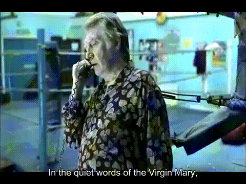

## CROP

```bash
ffmpeg -i in.mp4 -filter:v "crop=out_w:out_h:x:y" out.mp4
```
*  out_w width of the output rectangle
*  out_h height of the output rectangle
*  x / y top-left corner of the output rectangle
```bash
$ ffmpeg -i Shredder.mp4 -filter:v "crop=1000:720:200:0" out.mp4
```

## SCALE

```bash
$ ffmpeg -i out.mp4 -filter:v scale=720:-1 -c:a copy shred.mp4
```
*  scale=w:h
*  -1 to let ffmpeg calculate the correct value

## EXTRACT PORTION

```bash
$ ffmpeg -ss 00:00:30.0 -i input.wmv -c copy -t 00:00:10.0 output.wmv
```

## SLICED SAUSAGE

```bash
$ ffmpeg -i movie.mp4 2>&1 | grep Duration | awk '{print $2}' | tr -d ,
```
output:

`00:05:49.63`

So 6 minutes. Let's make 6 slices.

```bash
$ for i in {0..5}; do
> ffmpeg -ss 00:0$i:00 -i movie.mp4 -c copy -t 00:01:00.0 movie_$i.mp4;
> done
```
Wait a while...

```bash
$ ls
```

output:

movie.mp4	movie_1.mp4	movie_2.mp4	movie_3.mp4	movie_4.mp4	movie_5.mp4	movie_6.mp4

## CONCATENATE FILES

```bash
$ cat mylist.txt
file '/path/to/file1'
file '/path/to/file2'
file '/path/to/file3'

$ ffmpeg -f concat -safe 0 -i mylist.txt -c copy output.mp4
```

## CONVERT TO GIF

```bash
$ cat gifenc.sh

#!/bin/sh
palette="/tmp/palette.png"
filters="fps=$4,scale=$3:-1:flags=lanczos"
ffmpeg -v warning -i "$1" -vf "$filters,palettegen" -y "$palette"
ffmpeg -v warning -i "$1" -i $palette -lavfi "$filters [x]; [x][1:v] paletteuse" -y "$2"

$ ./gifenc.sh input.mov output.gif 720 10
```

This will convert "input.mov" to a GIF that's 720p wide 10fps.

## ADD SUBTITLES

First convert the subtitles to .ass format. [Yes, ass. Who doesn't love ass and videos, right?]

More seriously, this tip uses the [libass library](https://github.com/libass/libass). Make sure your ffmpeg install has the library in the configuration: `--enable-libass`.


```bash
$ ffmpeg -i subtitles.srt subtitles.ass
```

Then add them using a video filter:

```bash
$ ffmpeg -i mymovie.mp4 -vf ass=subtitles.ass mysubtitledmovie.mp4
```


## ADD OVERLAYS

```bash
$ ffmpeg -i input.mp4 -i image.png -filter_complex "[0:v][1:v] overlay=25:25:enable='between(t,0,20)'" \
-pix_fmt yuv420p -c:a copy output.mp4
```

* [0:v][1:v] video 1 (image.png) on top of video 0 (input.mp4)
* 25:25 25 px top-left
* `enable='between(t,0,20)` between seconds 0 and 20.
* `-pix_fmt yuv420p` color encoding system, 6 bytes per 4 pixels, reordered.
* `-c:a copy` copy the audio


## REMOVE AUDIO

```bash
$ ffmpeg -i input.mp4 -c copy -an output.mp4
```
